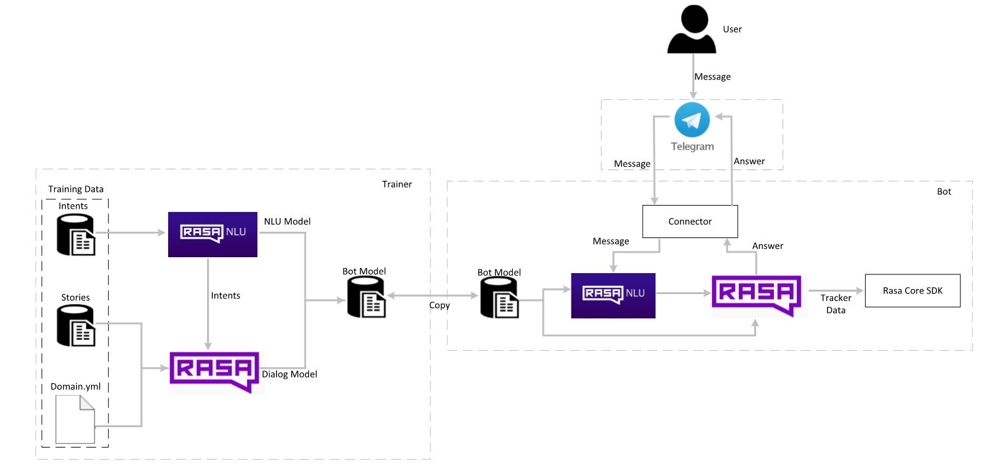

# MARIA - Me Ajuda Rápido com Inteligência Artificial

### Introdução

Um projeto feito em Rasa com a possibilidade para a construção de um projeto grande de chatbot.

Este projeto teve como base o projeto [Tais](http://github.com/lappis-unb/tais).

### Objetivo

A MARIA é uma assitente virtual criada em forma de chatbot e desenvolvida pela equipe de tecnologia da Globo Brasília para auxiliar no cotidiano de diversos setores da emissora, 
provendo respostas rápida para questionamento simples e soluções para pequenos problemas que podem ocorrer ao longo da jornada de trabalho.

### Telegram

Este projeto foi pensado para ser usado com o Telegram como meio de comunicação entre a MARIA e o usúario, principalmente pelas vantagens onde:
*  A API é gratuita;
*  Existe um incentivo ao desenvolvimento de bots pelo Telegram;
*  Funcionalidades como: cards, botões e atalhos, imagens, vídeos.

### RASA

RASA é uma ferramenta que provê uma infraestrutura e as ferramentas necessárias para a criação de assistentes de alta perfomance. 
Foi escolhido essa estrutura por algumas vantagens que apresenta:
*  Build local;
*  Customizável;
*  Fácil migração de outras plataformas;
*  Rasa Core e Rasa NLU para contexto de conversação.


### Entenda a Arquitetura

É utilizado na MARIA diversas tecnologias que interagem entre si para obter um melhor resultado. Veja a arquitetura implementada:



O usuário interage com a MARIA via Telegram, que manda as mensagens para o Rasa NLU através de
conectores, onde ele identifica a *intent*, e responde pelo Rasa Core, de acordo com as *stories* e *actions*.  
As *models* utilizadas para a conversação foram geradas pelo módulo *trainer* e depois transferidas para o bot, estes
modelos podem ser versionados e evoluídos entre bots.  
Os notebooks avaliam o funcionamento de acordo com o formato das *intents* e *stories*.


### Documentação

Nesta wiki é possível encontrar os procedimentos necessários para fazer a manutenção e realizar atualizações.


* [Como acessar a máquina virtual e o código]

- Máquina Virtual
1.  Entre no [vSphere](https://tvg-bsa-vcenter/) e faça login com suas credenciais
2.  Procure por TVG-BSA-QRCODE na lista de máquinas virtuais disponíveis
3.  Clique em launch console
4.  Entre com as credenciais conforme consta no TeamPass

- Ambientes da Maria
O console com o ambiente de produção e de testes da Maria já estarão rodando.
Abra o terminal e insira o seguinte path:

```sh
cd ~/Desktop/MARIA_globo
```

Para ver o estado dos containers, bem como os logs:

```sh
docker-compose logs
``` 

Para acessar o Visual Studio com o código do bot basta entrar com o comando *code.* no console de teste ou no de produção.
```sh
sudo code .
```  


**ATENÇÃO:** o ngrok, responsável pelo tunelamento entre o rasa e o telegram **NÃO PODE SER FECHADO**. Se caso for fechado, o bot não irá mais responder. Utilize o seguinte comando para fazê-lo retornar:
```sh
./ngrok http 5001 -subdomain (o subdomínio estará na pasta env, no arquivo "telegram")
```

* [Como adicionar utter, intent e stories no rasa](https://github.com/suporte-bsa/Maria_Globo/blob/master/docs/Tutoriais/tutorial-primeira-conversa.md);

*Configurar o projeto

Para ter seu chatbot Rasa no ar e funcionando rápidamente no `shell` execute os seguintes comandos:

```sh
sudo make build-bot
sudo make train
sudo make run-console
```

* Como treinar o bot

**Atenção**: o comando de treinamento é usado para criar os modelos necessários na conversação do bot para treinar o seu chatbot execute o comando:
```sh
sudo make train
```

- Console

```sh
sudo make run-console
```

* Como subir pro telegram

Agora é possível realizar a execução do bot no telegram corretamente.

Execute o bot no telegram:

```sh
sudo docker-compose up bot_telegram
```

* Analytics;

Para a visualização dos dados da interação entre o usuário e o chatbot nós utilizamos uma parte da Stack do Elastic, composta pelo ElasticSearch e o Kibana. Com isso, utilizamos um broker para fazer a gerência de mensagens. Então conseguimos adicionar mensagens ao ElasticSearch independente do tipo de mensageiro que estamos utilizando.

- Configuração do RabbitMQ

Em primeiro lugar para fazer o setup do analytics é necessário subir o RabiitMQ e suas configurações.

Inicie o serviço do servidor do RabbitMQ:

```sh
sudo docker-compose up -d rabbitmq
```

Inicie o serviço do consumidor do RabbitMQ, que ficará responsável por enviar as mensagens para o ElasticSearch:

```sh
sudo docker-compose up -d rabbitmq-consumer
```

Lembre-se de configurar as seguintes variáveis de ambiente do serviço `rabbitmq-consumer` no `docker-compose`.

```sh
ENVIRONMENT_NAME=localhost
BOT_VERSION=last-commit-hash
RABBITMQ_DEFAULT_USER=admin
RABBITMQ_DEFAULT_PASS=admin
```

Sendo que as configurações de `RABBITMQ_DEFAULT_USER` e `RABBITMQ_DEFAULT_PASS` devem ser as mesmas definidas no serviço do `rabbitmq`.

- Integração com Rasa

Existem duas formas para executar a Tais com o *broker*. A primeira delas é via linha de comando.
Para utilizar esta forma é preciso definir Dentro do arquivo `endpoints.yml` as configurações do broker:

```yml
event_broker:
  url: rabbitmq
  username: admin
  password: admin
  queue: bot_messages
```

Depois basta executar o bot:

```sh
sudo docker-compose run --rm bot make run-console-broker
```

A segunda forma é utilizando o script `run-rocketchat` que é utilizado quando o bot é executado com o RocketChat como canal. Para isso, as mesmas variáveis devem ser configuradas no arquivo `docker/bot/bot.env`.
Lembre-se também de configurar como `True` a seguinte variável do serviço `bot` no arquivo `docker/bot-rocketchat.env`.

```
# Broker config
BROKER_URL=rabbitmq
BROKER_USERNAME=admin
BROKER_PASSWORD=admin
QUEUE_NAME=bot_messages
```

Ao final é necessário buildar novamente o container do bot.

```
sudo docker-compose up --build -d bot
```

- Configuração ElasticSearch

O ElasticSearch é o serviço responsável por armazenar os dados provenientes da interação entre o usuário e o chatbot.

As mensagens são inseridas no índice do ElasticSearch utilizando o *broker* RabbitMQ.

Para subir o ambiente do ElasticSearch rode os seguintes comandos:

```
sudo docker-compose up -d elasticsearch
sudo docker-compose run --rm -v $PWD/analytics:/analytics bot python /analytics/setup_elastic.py
```

Lembre-se de setar as seguintes variaveis de ambiente no `docker-compose`.

```
ENVIRONMENT_NAME=localhost
BOT_VERSION=last-commit-hash
```

- Setup Kibana (Visualização)

Para a análise dos dados das conversas com o usuário, utilize o kibana, e veja como os usuários estão interagindo com o bot, os principais assuntos, média de usuários e outras informações da análise de dados.

O Kibana nos auxilia com uma interface para criação de visualização para os dados armazenados nos índices do ElasticSearch.

```sh
sudo docker-compose up -d kibana
```

**Atenção:** Caso queira configurar permissões diferentes de usuários (Login) no ElasticSearch/Kibana, siga esse tutorial ([link](https://github.com/suporte-bsa/Maria_Globo/blob/master/docs/Setup/setup_user_elasticsearch.md)).


